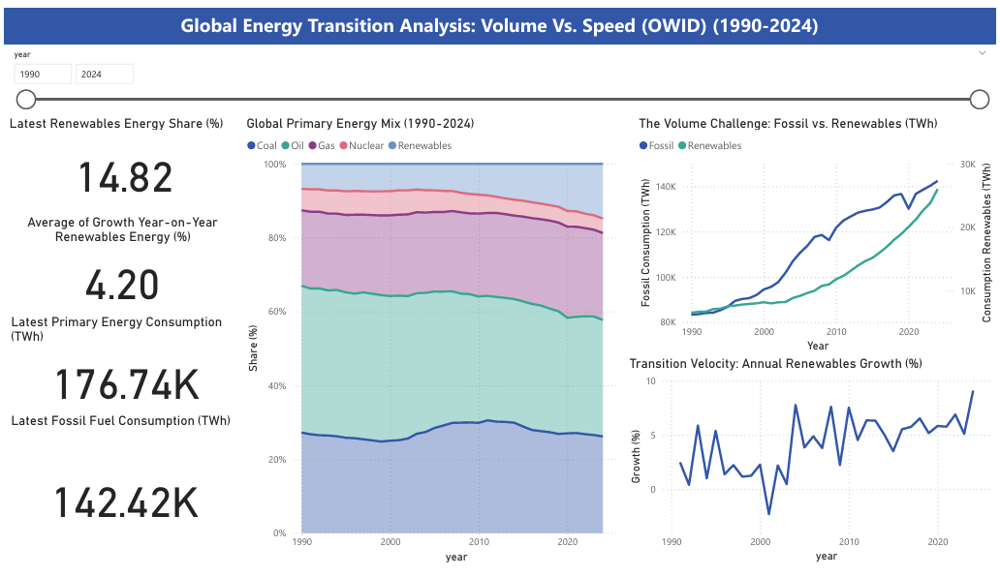

# Global Energy Transition Analysis: Volume Vs. Speed (OWID) (1990-2024)

## Background

The global energy transition presents a unique analytical challenge: it is difficult to compare the vast scale of existing fossil fuel infrastructure with the accelerated growth rate of new clean technologies. Reports often focus only on percentages, which can obscure the sheer Volume difference, or they focus only on exponential growth, which can overstate the current Impact of renewables.

This project aims to directly address this gap by quantifying the duality. Using the OWID Global Energy Dataset (1990-2024), we explicitly compare Fossil Fuel Volume versus Renewables Annual Growth Rate (Speed). This provides a clearer, data-driven perspective on both the impressive progress and the remaining immense challenge of global decarbonization.

## Tools and Methodology

### Data Source

Our World in Data (OWID) Energy Dataset (filtered for "World" entity and 1990-2024 for year)

### Tools

 - Python: Using Pandas for data gathering and cleaning
 - Power BI: Used to design an interactive dashboard with KPIs, time-series, charts, and dual-axis visualization

### Key Metrics

Primary Energy Consumption, Renewables Share, Fossil Fuels Consumption, Renewables YoY Growth (Velocity).

## Key Analytical Finding

### 1. The Volume Challenge: Fossil Fuel Dominance (Refers to the Dual Axis Charts)

The absolute volume consumed by fossil fuels continues to dwarf that of renewables, indicating the sheer scale of the transition required.

- Massive Gap: In 2024, Global Fossil Fuel Consumption was 142.42K TWh, consuming approximately 7 times the volume of renewables.

- Energy Addition: The primary role of renewable energy growth over the last decade has been to meet rising global energy demand, rather than actively displacing significant volumes of fossil fuel consumption.

### 2. Slow Inertia in the Energy Mix (Refers to the Stacked Area Chart)

Despite decades of policy push and technological advancements, the overall composition of global primary energy remains highly resistant to rapid change.

- Fossil Fuel Share: The fossil fuel complex (Coal, Oil, Gas) consistently accounts for approximately [~80]% of the total primary energy mix, showing minimal long-term decline.

- Renewables Share: Renewables have grown from about 6.80% in 1990 to only 14.82% in 2024.

### 3. Evidence of Acceleration (Refers to the YoY Growth Rate Chart)

While the share changes slowly, the rate of change in renewables is robust and accelerating, primarily driven by Solar and Wind technologies (although not explicitly separated here).

- High Velocity: The average Year-over-Year (YoY) Growth Rate for renewables over the last decade is a strong [4.20]%.

- Peak Growth: The YoY growth spikes observed post-2010 correspond directly to the dramatic drop in Solar PV and wind turbine manufacturing costs, signaling technological market penetration.

